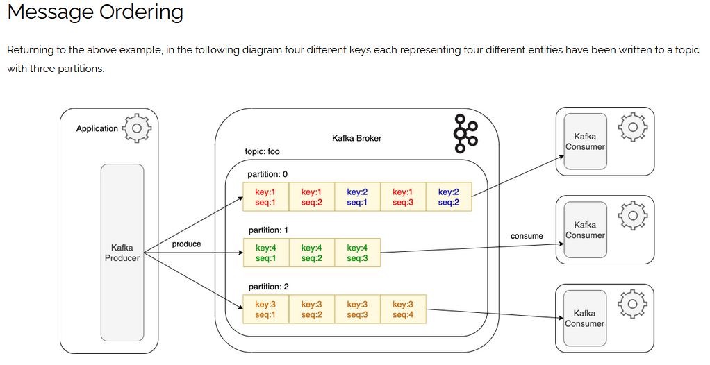
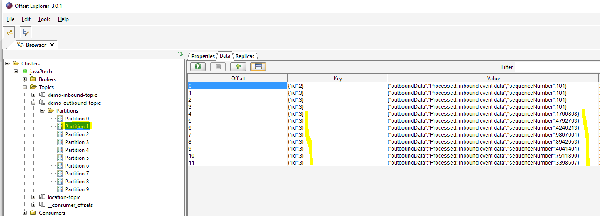

### Kafka Spring Boot Message Keys Demo Project
- Spring Boot application demonstrating use of Kafka message keys, partitions, and message ordering.

## Flow Diagram


## Prerequisites
- Spring Boot (3.2.1)
- Maven 
- Docker
- Java (17)
- Libraries:
  * starter-web 
  * kafka
  * lombok/logback

## Build
- With Java version 17:

```
mvn clean install
```
## Run Spring Boot Application
- Applicaton can be testes manually or by using Docker compose file as below:

## Test unique key
- Call v1 API with 25 messages processing (http://localhost:9001/kafka/v1/messages/25)
- 10 partitions are created in one topic where same unique key (eg. key:3) is in partion 1 as an example below.


- NOTE: Kafka hashes the key, and the result is used to map the message to a specific partition.

###----------------Manual Process--------------------------

## START THE KAFKA ENVIRONMENT:
- NOTE: Local environment must have Java 8+ installed.

- Kafka Servers Start (local: eg. C:\kafka_2.13-3.7.0) with zookeeper.
* 1) .\bin\windows\zookeeper-server-start.bat .\config\zookeeper.properties
* 2) .\bin\windows\kafka-server-start.bat .\config\server.properties

#### View topics
- Offset Explorer/Conduktor Kafka tool can be used 

###----------------Docker Process --------------------------

## Run docker containers

- From root dir run the following to start dockerised Kafka, Zookeeper:
```
docker-compose up -d
```

### Start demo spring boot application
```
java -jar target/kafka-message-keys-1.0.0.jar
```

### Produce an inbound event:

- Go to Kafka docker container:
```
docker exec -ti kafka bash
```

- Produce a demo-inbound message:
```
kafka-console-producer \
--topic demo-inbound-topic \
--broker-list kafka:29092 \
--property parse.key=true \
--property "key.separator=;"

```
- Now enter the message (with key prefix):
```
{"id":"123"};{"inboundData": "my-data", "sequenceNumber": 1}
```
- The demo-inbound message is consumed by the application, which emits a resulting demo-outbound message.

- The application logs:
```
Received message - key id: 123 - partition: 2 - payload: DemoInboundPayload(inboundData=my-data, sequenceNumber=1)
Emitted message - key: DemoOutboundKey(id=123) - payload: Processed: my-data
```

- Check for the emitted demo-outbound message:
```
kafka-console-consumer \
--topic demo-outbound-topic \
--bootstrap-server kafka:29092 \
--from-beginning \
--property print.key=true \
--property key.separator=";" \
-- from-beginning
```
- Output:
```
{"id":123};{"outboundData":"Processed: my-data","sequenceNumber":1}
```

- End messages with the same key id, and observe the application logs that they are always received on the same partition.

### Command Line Tools

#### View topics

- Go to Kafka docker container:
```
docker exec -ti kafka bash
```

- List topics:
```
kafka-topics --list --bootstrap-server localhost:9092
```

- Describe the demo consumer group:
```
kafka-consumer-groups --bootstrap-server localhost:9092 --describe --group demo-consumer-group
```

## Integration Tests

- Run integration tests with `mvn clean test`

- The tests demonstrate sending JSON events to an embedded in-memory Kafka that are consumed by the application, resulting in outbound JSON events being published.

- It also verifies that message ordering is preserved for all messages with a given key.

## Component Tests

- The tests demonstrate sending JSON events to a dockerised Kafka that are consumed by the dockerised application, resulting in outbound JSON events being published.

- It also verifies that all messages with the same key are written to the same partition.

- Build Spring Boot application jar:
```
mvn clean install
```

- Build Docker container:
```
docker build -t ct/kafka-message-keys:latest .
```

- Run tests:
```
mvn test -Pcomponent
```

- Run tests leaving containers up:
```
mvn test -Pcomponent -Dcontainers.stayup
```

- Manual clean up (if left containers up):
```
docker rm -f $(docker ps -aq)
```

- Further docker clean up if network/other issues:
```
docker system prune
docker volume prune
```
